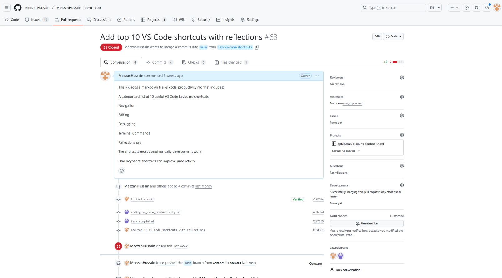

# CI/CD Static Analysis Reflection

## What is the purpose of CI/CD?

CI/CD (Continuous Integration/Continuous Deployment) automates the software development workflow. It catches issues early by running tests, linting, and quality checks automatically when code changes are pushed. This prevents bugs from reaching production and ensures consistent code quality across the team.

## How does automating style checks improve project quality?

Automated style checks catch problems before they become bigger issues. When I set up Markdown linting and spell checking, it immediately caught formatting inconsistencies and typos that I would have missed manually. This keeps documentation clean and professional, which is crucial for project maintainability.

## What are some challenges with enforcing checks in CI/CD?

The main challenge is balancing strictness with developer productivity. If checks are too strict, developers spend more time fixing style issues than writing features. If too lenient, quality suffers. Another challenge is handling false positives - sometimes legitimate code gets flagged incorrectly, requiring careful configuration tuning.

## How do CI/CD pipelines differ between small projects and large teams?

**Small projects**: Simple pipelines with basic checks (linting, testing). Fast feedback loops, easy to modify. Developers can quickly iterate and fix issues.

**Large teams**: Complex pipelines with multiple stages, security scans, performance tests, and deployment to multiple environments. More sophisticated approval processes and longer feedback cycles, but better protection against breaking changes affecting many users.

## Evidence of Work

**Commit Hash**: `3c816a5` - "Add CI/CD workflow for Markdown linting and spell checks"

**Screenshot Proof**: 

This commit includes:
- GitHub Actions workflow (`.github/workflows/markdown-lint.yml`)
- Spell check configuration (`.cspell.json`) 
- Package.json with Husky pre-commit hooks
- Automated checks for PRs and pushes

The workflow runs markdownlint, cspell, and link checking on all Markdown files, ensuring consistent quality across the repository.
