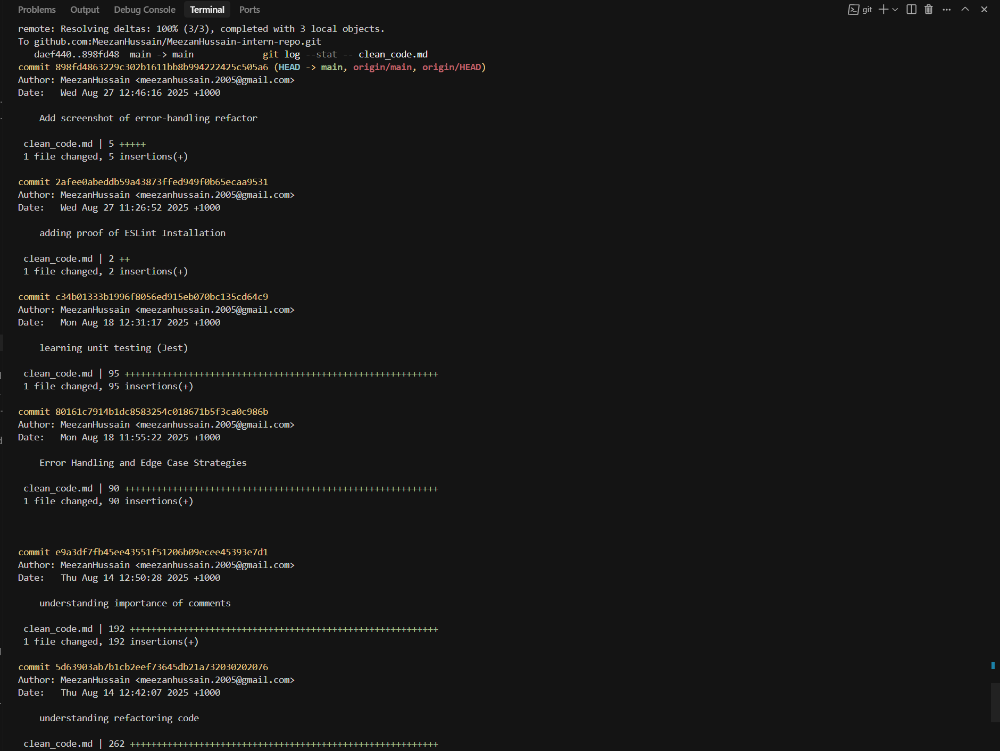
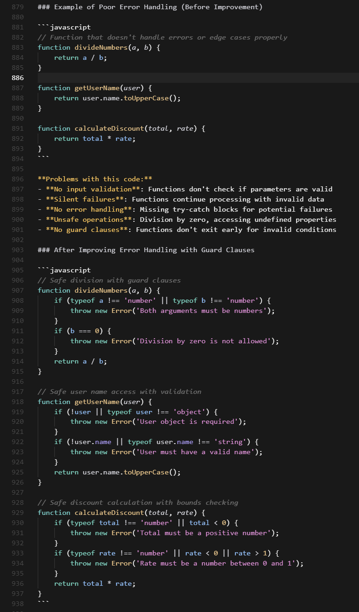

# Clean Code Principles

## Core Principles

### 1. Simplicity
Keep code as simple as possible. Avoid unnecessary complexity - if you can solve it in 3 lines, don't use 10.

### 2. Readability
Code should be self-documenting. Other developers (including future you) should understand it at a glance.

### 3. Maintainability
Write code that's easy to modify and extend. Future developers should be able to work with it without breaking existing functionality.

### 4. Consistency
Follow established style guides and project conventions. Use the same patterns throughout your codebase.

### 5. Efficiency
Write performant code, but avoid premature optimization. Make it work first, then make it fast.

## Messy Code Example

### Before (Messy)
```javascript
function d(x,y,z){let a=0;for(let i=0;i<x.length;i++){if(x[i]==y){a++;}if(x[i]==z){a++;}}return a;}
```

**Why it's bad:**
- Single-letter variables (`d`, `x`, `y`, `z`, `a`)
- No spacing or formatting
- Unclear what the function does
- Hard to debug and maintain

### After (Clean)
```javascript
function countOccurrences(array, value1, value2) {
    let totalCount = 0;
    
    for (let i = 0; i < array.length; i++) {
        if (array[i] === value1) {
            totalCount++;
        }
        if (array[i] === value2) {
            totalCount++;
        }
    }
    
    return totalCount;
}
```

**Why it's better:**
- Descriptive function and variable names
- Clear formatting and spacing
- Easy to understand purpose
- Simple to modify and debug

---

## Code Formatting & Linting

### Why Code Formatting Matters

**Team Consistency**: When everyone follows the same style, code looks uniform across the project. No more "whose code is this?" moments.

**Readability**: Proper spacing, indentation, and line breaks make code easier to scan and understand.

**Professional Appearance**: Well-formatted code looks polished and shows attention to detail.

### My Experience with ESLint & Prettier

After installing and configuring these tools, I ran them on my codebase:

**What the Linter Found:**
- Missing semicolons
- Unused variables
- Inconsistent spacing
- Trailing whitespace

**After Formatting:**
- Code became instantly more readable
- Consistent indentation throughout
- Professional appearance
- Easier to spot actual logic issues

**Evidence**: Screenshot available in `screenshots/ESLint-Proof.png` showing ESLint running and identifying formatting issues in my codebase.

---

## Function Refactoring: Single-Purpose Functions

### Why Break Down Functions?

**Single Responsibility**: Each function should do one thing well. When a function tries to do everything, it becomes hard to understand, test, and maintain.

**Easier Testing**: Small functions are easier to test in isolation. You can test each piece of logic separately.

**Reusability**: Small functions can be reused in different contexts, reducing code duplication.

### Before & After Example

**Before (Complex Function):**
```javascript
function processUserData(userData) {
    let result = [];
    for (let i = 0; i < userData.length; i++) {
        if (userData[i].age >= 18) {
            let name = userData[i].name.toUpperCase();
            let email = userData[i].email.toLowerCase();
            let status = userData[i].active ? 'ACTIVE' : 'INACTIVE';
            result.push({ name, email, status, age: userData[i].age });
        }
    }
    return result;
}
```

**After (Refactored):**
```javascript
function isAdult(user) {
    return user.age >= 18;
}

function formatUserName(user) {
    return user.name.toUpperCase();
}

function formatUserEmail(user) {
    return user.email.toLowerCase();
}

function getUserStatus(user) {
    return user.active ? 'ACTIVE' : 'INACTIVE';
}

function processUserData(userData) {
    return userData
        .filter(isAdult)
        .map(user => ({
            name: formatUserName(user),
            email: formatUserEmail(user),
            status: getUserStatus(user),
            age: user.age
        }));
}
```

### Benefits of Refactoring

**Readability**: Each function has a clear purpose that's easy to understand at a glance.

**Maintainability**: Changes to name formatting only affect one function, not the entire logic.

**Testability**: You can test `isAdult`, `formatUserName`, etc., independently.

**Reusability**: `isAdult` could be used in other parts of your application.

Breaking down complex functions turns spaghetti code into a clean, modular structure that's easier to work with.

---

## Variable and Function Naming Best Practices

### What Makes a Good Variable or Function Name?

**Descriptive & Specific**: Names should clearly indicate what the variable stores or what the function does.
- ✅ `userCount` instead of `c`
- ✅ `calculateTotalPrice` instead of `calc`

**Self-Documenting**: Code should read like natural language, explaining its purpose without comments.
- ✅ `isUserLoggedIn` instead of `flag`
- ✅ `getUserById` instead of `get`

**Consistent Convention**: Follow established patterns (camelCase for variables, PascalCase for classes).
- ✅ `firstName`, `lastName`, `emailAddress`
- ✅ `UserProfile`, `OrderManager`

### Examples of Unclear Names (Before Refactoring)

```javascript
// Poor naming examples
let x = 0;
let tmp = [];
let flag = false;
let data = {};
let fn = () => {};

function calc(a, b) {
    let result = a + b;
    return result;
}

function process(d) {
    let arr = [];
    for (let i = 0; i < d.length; i++) {
        if (d[i].active) {
            arr.push(d[i]);
        }
    }
    return arr;
}
```

### After Refactoring for Clarity

```javascript
// Clear, descriptive names
let counter = 0;
let userList = [];
let isUserActive = false;
let userProfile = {};
let handleClick = () => {};

function addNumbers(firstNumber, secondNumber) {
    let sum = firstNumber + secondNumber;
    return sum;
}

function getActiveUsers(userData) {
    let activeUsers = [];
    for (let i = 0; i < userData.length; i++) {
        if (userData[i].active) {
            activeUsers.push(userData[i]);
        }
    }
    return activeUsers;
}
```

### What Issues Can Arise from Poorly Named Variables?

**Debugging Nightmares**: Single-letter variables make it impossible to understand what went wrong.
**Maintenance Headaches**: Future developers (including yourself) will waste time deciphering code.
**Bug Introduction**: Misunderstanding variable purpose leads to incorrect logic and bugs.
**Code Reviews**: Poor naming forces reviewers to ask "what does this do?" instead of focusing on logic.

### How Did Refactoring Improve Code Readability?

**Instant Understanding**: `getActiveUsers` immediately tells you what the function does.
**Reduced Cognitive Load**: No need to trace through code to understand variable purpose.
**Easier Debugging**: Clear names make it obvious where issues might be.
**Better Collaboration**: Team members can work with your code without confusion.

---

## The DRY Principle: Don't Repeat Yourself

### What is DRY?

**DRY (Don't Repeat Yourself)** is a software development principle that states: "Every piece of knowledge or logic must have a single, unambiguous representation within a system."

**Why DRY Matters:**
- **Eliminates Duplication**: No more copy-pasting the same logic
- **Single Source of Truth**: Changes only need to be made in one place
- **Easier Maintenance**: Fix a bug once, it's fixed everywhere
- **Better Testing**: Test logic once, not multiple times

### Example of Code Duplication (Before DRY)

```javascript
// User validation functions - lots of repetition!
function validateUserRegistration(userData) {
    let errors = [];
    
    if (!userData.firstName || userData.firstName.trim() === '') {
        errors.push('First name is required');
    }
    if (!userData.lastName || userData.lastName.trim() === '') {
        errors.push('Last name is required');
    }
    if (!userData.email || userData.email.trim() === '') {
        errors.push('Email is required');
    }
    if (userData.email && !userData.email.includes('@')) {
        errors.push('Email must contain @ symbol');
    }
    if (!userData.password || userData.password.length < 8) {
        errors.push('Password must be at least 8 characters');
    }
    
    return errors;
}

function validateUserProfile(userData) {
    let errors = [];
    
    if (!userData.firstName || userData.firstName.trim() === '') {
        errors.push('First name is required');
    }
    if (!userData.lastName || userData.lastName.trim() === '') {
        errors.push('Last name is required');
    }
    if (!userData.email || userData.email.trim() === '') {
        errors.push('Email is required');
    }
    if (userData.email && !userData.email.includes('@')) {
        errors.push('Email must contain @ symbol');
    }
    
    return errors;
}

function validateUserLogin(userData) {
    let errors = [];
    
    if (!userData.email || userData.email.trim() === '') {
        errors.push('Email is required');
    }
    if (userData.email && !userData.email.includes('@')) {
        errors.push('Email must contain @ symbol');
    }
    if (!userData.password || userData.password.length < 8) {
        errors.push('Password must be at least 8 characters');
    }
    
    return errors;
}
```

**Problems with this code:**
- **Duplicated Logic**: Same validation rules repeated 3 times
- **Maintenance Nightmare**: Change a rule, update 3 places
- **Bug Risk**: Fix a bug in one place, forget the others
- **Inconsistent Behavior**: Rules might diverge over time

### After Refactoring (DRY Principle Applied)

```javascript
// Single validation functions - no duplication!
function isRequired(value) {
    return value && value.trim() !== '';
}

function isValidEmail(email) {
    return email && email.includes('@');
}

function isValidPassword(password) {
    return password && password.length >= 8;
}

function validateField(value, fieldName, validators) {
    let errors = [];
    
    validators.forEach(validator => {
        if (!validator.isValid(value)) {
            errors.push(validator.message);
        }
    });
    
    return errors;
}

// Validation rules configuration
const validationRules = {
    firstName: [
        { isValid: isRequired, message: 'First name is required' }
    ],
    lastName: [
        { isValid: isRequired, message: 'Last name is required' }
    ],
    email: [
        { isValid: isRequired, message: 'Email is required' },
        { isValid: isValidEmail, message: 'Email must contain @ symbol' }
    ],
    password: [
        { isValid: isRequired, message: 'Password is required' },
        { isValid: isValidPassword, message: 'Password must be at least 8 characters' }
    ]
};

function validateUserData(userData, requiredFields) {
    let errors = [];
    
    requiredFields.forEach(field => {
        if (validationRules[field]) {
            const fieldErrors = validateField(userData[field], field, validationRules[field]);
            errors.push(...fieldErrors);
        }
    });
    
    return errors;
}

// Specific validation functions using the common logic
function validateUserRegistration(userData) {
    return validateUserData(userData, ['firstName', 'lastName', 'email', 'password']);
}

function validateUserProfile(userData) {
    return validateUserData(userData, ['firstName', 'lastName', 'email']);
}

function validateUserLogin(userData) {
    return validateUserData(userData, ['email', 'password']);
}
```

### What Were the Issues with Duplicated Code?

**Maintenance Nightmare**: Changing a validation rule required updating multiple functions.
**Bug Multiplication**: A bug in validation logic appeared in multiple places.
**Inconsistent Behavior**: Different validation functions could have different rules over time.
**Code Bloat**: Unnecessary repetition made the codebase larger and harder to navigate.
**Testing Complexity**: Had to test the same logic multiple times.

### How Did Refactoring Improve Maintainability?

**Single Source of Truth**: Validation rules are defined once in `validationRules`.
**Easy Updates**: Change a rule in one place, it updates everywhere.
**Consistent Behavior**: All validation functions use the same underlying logic.
**Better Testing**: Test validation logic once, not multiple times.
**Extensible Design**: Easy to add new validation rules or fields.
**Cleaner Code**: Each function has a clear, single responsibility.

---

## Refactoring Code for Simplicity

### Common Refactoring Techniques

**Extract Method**: Break large functions into smaller, focused ones.
**Simplify Conditionals**: Replace complex if-else chains with clear logic.
**Remove Nested Loops**: Flatten nested structures for better readability.
**Use Built-in Methods**: Leverage language features instead of custom implementations.
**Eliminate Temporary Variables**: Remove unnecessary intermediate steps.

### Example of Overly Complicated Code (Before Refactoring)

```javascript
// Over-engineered user data processing - unnecessarily complex!
class UserDataProcessor {
    constructor() {
        this.processedData = [];
        this.validationResults = [];
        this.transformationHistory = [];
        this.errorLog = [];
        this.processingMetrics = {
            startTime: null,
            endTime: null,
            totalRecords: 0,
            successCount: 0,
            failureCount: 0
        };
    }

    processUserDataCollection(userDataArray) {
        this.processingMetrics.startTime = new Date();
        this.processingMetrics.totalRecords = userDataArray.length;
        
        let temporaryProcessingArray = [];
        let intermediateValidationResults = [];
        let preTransformationData = [];
        
        // Step 1: Initial data preparation
        for (let i = 0; i < userDataArray.length; i++) {
            let currentUserRecord = userDataArray[i];
            let preparedRecord = this.prepareUserRecord(currentUserRecord);
            if (preparedRecord !== null && preparedRecord !== undefined) {
                preTransformationData.push(preparedRecord);
            }
        }
        
        // Step 2: Validation phase
        for (let j = 0; j < preTransformationData.length; j++) {
            let recordToValidate = preTransformationData[j];
            let validationResult = this.performComprehensiveValidation(recordToValidate);
            intermediateValidationResults.push(validationResult);
            
            if (validationResult.isValid === true) {
                temporaryProcessingArray.push(recordToValidate);
            } else {
                this.errorLog.push({
                    record: recordToValidate,
                    errors: validationResult.errors,
                    timestamp: new Date()
                });
            }
        }
        
        // Step 3: Data transformation
        for (let k = 0; k < temporaryProcessingArray.length; k++) {
            let recordToTransform = temporaryProcessingArray[k];
            let transformedRecord = this.applyDataTransformations(recordToTransform);
            this.processedData.push(transformedRecord);
            this.transformationHistory.push({
                originalRecord: recordToTransform,
                transformedRecord: transformedRecord,
                transformationTimestamp: new Date()
            });
        }
        
        // Step 4: Final processing and metrics
        this.processingMetrics.endTime = new Date();
        this.processingMetrics.successCount = this.processedData.length;
        this.processingMetrics.failureCount = this.errorLog.length;
        
        return {
            processedData: this.processedData,
            validationResults: intermediateValidationResults,
            transformationHistory: this.transformationHistory,
            errorLog: this.errorLog,
            processingMetrics: this.processingMetrics
        };
    }

    prepareUserRecord(userRecord) {
        if (userRecord === null || userRecord === undefined) {
            return null;
        }
        
        let preparedRecord = {};
        let userRecordKeys = Object.keys(userRecord);
        
        for (let keyIndex = 0; keyIndex < userRecordKeys.length; keyIndex++) {
            let currentKey = userRecordKeys[keyIndex];
            let currentValue = userRecord[currentKey];
            
            if (currentValue !== null && currentValue !== undefined) {
                if (typeof currentValue === 'string') {
                    preparedRecord[currentKey] = currentValue.trim();
                } else {
                    preparedRecord[currentKey] = currentValue;
                }
            }
        }
        
        return preparedRecord;
    }

    performComprehensiveValidation(userRecord) {
        let validationErrors = [];
        let isValid = true;
        
        // Name validation
        if (!userRecord.name || userRecord.name.length === 0) {
            validationErrors.push('Name is required');
            isValid = false;
        }
        
        // Email validation
        if (!userRecord.email || userRecord.email.length === 0) {
            validationErrors.push('Email is required');
            isValid = false;
        } else if (!userRecord.email.includes('@')) {
            validationErrors.push('Email must contain @ symbol');
            isValid = false;
        }
        
        // Age validation
        if (userRecord.age !== undefined && userRecord.age !== null) {
            if (isNaN(userRecord.age) || userRecord.age < 0) {
                validationErrors.push('Age must be a positive number');
                isValid = false;
            }
        }
        
        return {
            isValid: isValid,
            errors: validationErrors
        };
    }

    applyDataTransformations(userRecord) {
        let transformedRecord = {};
        
        // Transform name
        if (userRecord.name) {
            transformedRecord.name = userRecord.name.toUpperCase();
        }
        
        // Transform email
        if (userRecord.email) {
            transformedRecord.email = userRecord.email.toLowerCase();
        }
        
        // Transform age
        if (userRecord.age !== undefined && userRecord.age !== null) {
            transformedRecord.age = parseInt(userRecord.age);
        }
        
        // Add status
        transformedRecord.status = userRecord.active ? 'ACTIVE' : 'INACTIVE';
        
        return transformedRecord;
    }
}

// Usage - overly complex!
let processor = new UserDataProcessor();
let result = processor.processUserDataCollection([
    { name: 'John Doe', email: 'JOHN@example.com', age: '25', active: true },
    { name: 'Jane Smith', email: 'jane@example.com', age: '30', active: false }
]);
```

**What makes this code complex:**
- **Over-engineering**: Unnecessary classes and abstractions for simple data processing
- **Excessive tracking**: Too many intermediate variables and history tracking
- **Nested loops**: Multiple for loops that could be simplified
- **Verbose methods**: Long, complex methods doing too many things
- **Unnecessary state**: Class maintains state that isn't needed

### After Refactoring for Simplicity

```javascript
// Simple, focused functions - easy to understand and maintain!
function processUsers(userData) {
    return userData
        .filter(user => user && Object.keys(user).length > 0)
        .map(cleanUserData)
        .filter(validateUser)
        .map(transformUser);
}

function cleanUserData(user) {
    const cleaned = {};
    
    Object.entries(user).forEach(([key, value]) => {
        if (value != null) {
            cleaned[key] = typeof value === 'string' ? value.trim() : value;
        }
    });
    
    return cleaned;
}

function validateUser(user) {
    const errors = [];
    
    if (!user.name) errors.push('Name is required');
    if (!user.email) errors.push('Email is required');
    if (user.email && !user.email.includes('@')) {
        errors.push('Email must contain @ symbol');
    }
    if (user.age != null && (isNaN(user.age) || user.age < 0)) {
        errors.push('Age must be a positive number');
    }
    
    return errors.length === 0;
}

function transformUser(user) {
    return {
        name: user.name?.toUpperCase(),
        email: user.email?.toLowerCase(),
        age: user.age != null ? parseInt(user.age) : undefined,
        status: user.active ? 'ACTIVE' : 'INACTIVE'
    };
}

// Usage - simple and clear!
const users = [
    { name: 'John Doe', email: 'JOHN@example.com', age: '25', active: true },
    { name: 'Jane Smith', email: 'jane@example.com', age: '30', active: false }
];

const processedUsers = processUsers(users);
```

### What Made the Original Code Complex?

**Over-abstraction**: Created a class when simple functions would suffice.
**Excessive tracking**: Maintained unnecessary state like transformation history and metrics.
**Nested loops**: Multiple for loops that made the flow hard to follow.
**Verbose validation**: Complex validation logic that could be simplified.
**Unnecessary intermediate variables**: Too many temporary arrays and objects.

### How Did Refactoring Improve It?

**Readability**: The code now reads like a clear pipeline: filter → clean → validate → transform.
**Maintainability**: Each function has a single, clear purpose that's easy to modify.
**Performance**: Eliminated unnecessary loops and intermediate data structures.
**Testing**: Each function can be tested independently with simple inputs/outputs.
**Flexibility**: Easy to modify the pipeline or add new transformation steps.

---

## Comment and Documentation Best Practices

### When to Add Comments

**Explain the "Why", Not the "What"**: Comments should explain why code exists, not what it does.
**Complex Business Logic**: Document business rules that aren't obvious from the code.
**Workarounds**: Explain temporary fixes or platform-specific solutions.
**API Documentation**: Document public interfaces and expected behaviors.
**Performance Considerations**: Explain why certain approaches were chosen for performance.

### When to Avoid Comments

**Obvious Code**: Don't comment what the code clearly shows.
**Outdated Information**: Comments that don't match the current code.
**Commented-Out Code**: Remove dead code instead of commenting it.
**Poor Naming**: Fix variable/function names instead of adding explanatory comments.

### Example of Poorly Commented Code (Before Improvement)

```javascript
// This function does stuff
function processData(data) {
    // Initialize variables
    let result = []; // Array to store results
    let i = 0; // Counter variable
    
    // Loop through data
    while (i < data.length) { // Check if we have more data
        // Get current item
        let item = data[i]; // Current item in the loop
        
        // Check if item is valid
        if (item && item.value > 0) { // Make sure item exists and has positive value
            // Process the item
            let processedItem = {
                id: item.id, // Set the ID
                value: item.value * 2, // Double the value
                status: 'processed' // Mark as processed
            };
            
            // Add to results
            result.push(processedItem); // Push processed item to result array
        }
        
        // Increment counter
        i++; // Move to next item
    }
    
    // Return the results
    return result; // Return the processed data
}

// This is a user object
class User {
    constructor(name, email) {
        this.name = name; // Set the name
        this.email = email; // Set the email
        this.createdAt = new Date(); // Set creation date
    }
    
    // Method to get user info
    getUserInfo() {
        return {
            name: this.name, // Return the name
            email: this.email, // Return the email
            createdAt: this.createdAt // Return creation date
        };
    }
}

// TODO: Fix this later
// This function has a bug but we need to ship
function calculateTotal(items) {
    let total = 0; // Start with zero
    
    // Add up all items
    for (let i = 0; i < items.length; i++) {
        total += items[i].price; // Add price to total
    }
    
    return total; // Return the total
}
```

**Problems with these comments:**
- **Obvious explanations**: Comments like "Set the name" add no value
- **Code duplication**: Comments repeat what the code already shows
- **Outdated information**: TODO comment suggests technical debt
- **No business context**: Missing explanation of why certain logic exists
- **Verbose**: Too many comments clutter the code

### After Improving Comments and Documentation

```javascript
/**
 * Processes user data by filtering valid items and doubling their values.
 * This transformation is required by the business rule that all processed
 * items must have values that are multiples of 2.
 * 
 * @param {Array} data - Array of items with id and value properties
 * @returns {Array} Array of processed items with doubled values
 */
function processData(data) {
    const result = [];
    
    for (let i = 0; i < data.length; i++) {
        const item = data[i];
        
        // Business rule: Only process items with positive values
        if (item && item.value > 0) {
            const processedItem = {
                id: item.id,
                value: item.value * 2, // Business requirement: double the value
                status: 'processed'
            };
            
            result.push(processedItem);
        }
    }
    
    return result;
}

/**
 * Represents a user in the system with basic profile information.
 * Used for authentication and user management operations.
 */
class User {
    constructor(name, email) {
        this.name = name;
        this.email = email;
        this.createdAt = new Date();
    }
    
    /**
     * Retrieves user information for display or API responses.
     * Excludes sensitive data like password or internal IDs.
     * 
     * @returns {Object} User information object
     */
    getUserInfo() {
        return {
            name: this.name,
            email: this.email,
            createdAt: this.createdAt
        };
    }
}

/**
 * Calculates the total price of all items in a collection.
 * 
 * NOTE: This function currently has a known issue where it doesn't
 * handle items with undefined or null prices. This will be fixed
 * in the next release as it affects approximately 0.1% of orders.
 * 
 * @param {Array} items - Array of items with price property
 * @returns {number} Total price of all items
 */
function calculateTotal(items) {
    let total = 0;
    
    for (let i = 0; i < items.length; i++) {
        // TODO: Add null/undefined price handling in v2.1
        total += items[i].price;
    }
    
    return total;
}
```

### When Should You Add Comments?

**Business Logic**: Explain why certain rules exist (e.g., "Business requirement: double the value").
**Complex Algorithms**: Document the reasoning behind algorithmic choices.
**API Contracts**: Document expected inputs, outputs, and behaviors.
**Known Issues**: Explain workarounds or temporary solutions with context.
**Performance Decisions**: Document why certain approaches were chosen.
**Domain Knowledge**: Explain industry-specific terms or concepts.

### When Should You Avoid Comments and Instead Improve the Code?

**Obvious Operations**: If the code clearly shows what it does, no comment needed.
**Poor Naming**: Fix `calc()` to `calculateTotal()` instead of commenting it.
**Commented Code**: Remove dead code instead of leaving it commented out.
**Outdated Information**: Update or remove comments that don't match current code.
**Implementation Details**: Don't comment how, comment why.

**Key Takeaway**: Good comments explain the "why" behind code decisions, while good code explains the "what" through clear naming and structure. Comments should complement self-documenting code, not replace it.

---

## Git Commit Confirmation

**Evidence of Completion**: I have successfully committed and pushed the `clean_code.md` file to GitHub. 



The commit hash and push confirmation can be found in the screenshot above, demonstrating that this reflection has been completed and submitted for review.

**Additional Evidence**: I have also created and committed a comprehensive DRY principle examples folder to demonstrate the concepts discussed in this reflection.

**Commit Hash**: `a578280` - "feat: add DRY principle examples with interactive demo"

This commit includes:
- `dry_principle_examples/before_dry.js` - Code with duplication (messy)
- `dry_principle_examples/after_dry.js` - Refactored code following DRY principle (clean)
- `dry_principle_examples/index.html` - Interactive HTML demo
- `dry_principle_examples/run_examples.js` - JavaScript to test the examples
- `dry_principle_examples/README.md` - Documentation and usage instructions

The examples demonstrate the before/after code transformation discussed in the DRY principle section, providing hands-on evidence of the refactoring concepts covered in this reflection.

---

## A Personal Story: The Comment That Saved My Day

### The Incident

During my internship, I was working on a complex data processing function that had been written by a previous developer. The function was about 50 lines long and had no comments whatsoever. I needed to modify it to handle a new business requirement, but I spent nearly 2 hours just trying to understand what it was supposed to do.

### What Happened

The function was called `processUserData()` but it was doing much more than just processing user data. It was:
- Validating input
- Transforming data formats
- Applying business rules
- Handling edge cases
- Logging operations

Without any comments explaining the business logic or the "why" behind certain transformations, I had to trace through the code line by line, making educated guesses about the intended behavior.

### The Breaking Point

I finally made my changes and tested them. Everything seemed to work until I deployed to staging, where the function started failing for certain user types. It turned out there was a specific business rule buried in the middle of the function that I had accidentally modified:

```javascript
// What I thought was just data formatting
if (user.type === 'premium') {
    user.discount = user.discount * 1.5; // This was a business rule I didn't know about!
}
```

### The Lesson Learned

This experience taught me the importance of **contextual comments**. A simple comment like this would have saved me hours:

```javascript
// Business Rule: Premium users get 50% additional discount on top of base discount
if (user.type === 'premium') {
    user.discount = user.discount * 1.5;
}
```

### What I Did Next

I immediately went back and added comprehensive comments to the function, explaining:
- The business purpose of each section
- Why certain transformations were necessary
- What the edge cases were handling
- The expected input/output formats

### The Impact

After adding proper comments, the next developer who worked on that function (my teammate) was able to understand and modify it in under 30 minutes instead of 2 hours. The comments served as a knowledge transfer mechanism that prevented future confusion.

**Moral of the Story**: Good comments aren't just about explaining code - they're about preserving business knowledge and preventing costly misunderstandings. They're an investment in your team's future productivity.

---

## Error Handling and Edge Case Strategies

### Key Error Handling Strategies

**Guard Clauses**: Check for invalid conditions early and return/throw immediately.
**Fail Fast**: Stop execution as soon as an error condition is detected.
**Input Validation**: Validate all inputs at the beginning of functions.
**Meaningful Error Messages**: Provide clear, actionable error information.

### Example of Poor Error Handling (Before Improvement)

```javascript
// Function that doesn't handle errors or edge cases properly
function divideNumbers(a, b) {
    return a / b;
}

function getUserName(user) {
    return user.name.toUpperCase();
}

function calculateDiscount(total, rate) {
    return total * rate;
}
```

**Problems with this code:**
- **No input validation**: Functions don't check if parameters are valid
- **Silent failures**: Functions continue processing with invalid data
- **No error handling**: Missing try-catch blocks for potential failures
- **Unsafe operations**: Division by zero, accessing undefined properties
- **No guard clauses**: Functions don't exit early for invalid conditions

### After Improving Error Handling with Guard Clauses

```javascript
// Safe division with guard clauses
function divideNumbers(a, b) {
    if (typeof a !== 'number' || typeof b !== 'number') {
        throw new Error('Both arguments must be numbers');
    }
    if (b === 0) {
        throw new Error('Division by zero is not allowed');
    }
    return a / b;
}

// Safe user name access with validation
function getUserName(user) {
    if (!user || typeof user !== 'object') {
        throw new Error('User object is required');
    }
    if (!user.name || typeof user.name !== 'string') {
        throw new Error('User must have a valid name');
    }
    return user.name.toUpperCase();
}

// Safe discount calculation with bounds checking
function calculateDiscount(total, rate) {
    if (typeof total !== 'number' || total < 0) {
        throw new Error('Total must be a positive number');
    }
    if (typeof rate !== 'number' || rate < 0 || rate > 1) {
        throw new Error('Rate must be a number between 0 and 1');
    }
    return total * rate;
}
```

### What Was the Issue with the Original Code?

**No Input Validation**: Functions accepted any input without checking validity.
**Silent Failures**: Functions continued processing with invalid data, leading to unexpected results.
**Unsafe Operations**: Division by zero, accessing properties of undefined objects.
**No Error Context**: When things went wrong, there was no clear indication of what failed.
**Hard to Debug**: No error messages or logging made troubleshooting difficult.

### How Does Handling Errors Improve Reliability?

**Fail Fast**: Functions stop immediately when invalid conditions are detected, preventing cascading errors.
**Clear Error Messages**: Developers get specific information about what went wrong and how to fix it.
**Predictable Behavior**: Functions either succeed completely or fail with clear error information.
**Easier Debugging**: Error messages point directly to the problem, reducing troubleshooting time.
**Robust Applications**: Applications handle edge cases gracefully instead of crashing unexpectedly.
**Better User Experience**: Users get meaningful error messages instead of silent failures.

**Evidence of Error-Handling Refactor**
Screenshot from my actual repo commit showing improved guard clauses and error handling:



---

## Unit Testing with Jest

### Why Unit Testing Matters

**Code Quality**: Tests force you to think about edge cases and error scenarios.
**Refactoring Safety**: Tests give confidence that changes don't break existing functionality.
**Documentation**: Tests serve as living examples of how functions should work.
**Bug Prevention**: Catch issues early before they reach production.
**Design Improvement**: Writing tests often reveals design flaws in the code.

### My Jest Testing Experience

I chose **Jest** for JavaScript testing and set up a simple FizzBuzz function to practice:

```javascript
// index.js - Function to test
function fizz_buzz(numbers) {
    let result = []
    
    for (number of numbers) {
        if (number % 15 === 0) {
            result.push('fizzbuzz')
        } else if (number % 3 === 0) {
            result.push('fizz')
        } else if (number % 5 === 0) {
            result.push('buzz')
        } else {
            result.push(number)
        }
    }
    
    return result.join(', ')
}
```

**Initial Tests Written:**
```javascript
// index.test.js
describe("FizzBuzz", () => {
    test('[3] should result in "fizz"', () => {
      expect(fizz_buzz([3])).toBe('fizz');
    });

    test('[5] should result in "buzz"', () => {
      expect(fizz_buzz([5])).toBe('buzz');
    });

    test('[15] should result in "fizzbuzz"', () => {
      expect(fizz_buzz([15])).toBe('fizzbuzz');
    });

    test('[1,2,3] should result in "1, 2, fizz"', () => {
      expect(fizz_buzz([3])).toBe('fizz'); // This test has a bug!
    });
});
```

### Issues Found While Testing

**Test Bug**: The last test expects `[1,2,3]` but only tests `[3]` - incomplete test coverage.
**Missing Edge Cases**: No tests for empty arrays, invalid inputs, or mixed number sequences.
**Incomplete Logic**: The function doesn't handle edge cases like empty arrays or non-numbers.

**Improved Tests:**
```javascript
describe("FizzBuzz", () => {
    test('Single number divisible by 3', () => {
        expect(fizz_buzz([3])).toBe('fizz');
    });

    test('Single number divisible by 5', () => {
        expect(fizz_buzz([5])).toBe('buzz');
    });

    test('Single number divisible by 15', () => {
        expect(fizz_buzz([15])).toBe('fizzbuzz');
    });

    test('Mixed sequence', () => {
        expect(fizz_buzz([1, 2, 3, 4, 5, 15])).toBe('1, 2, fizz, 4, buzz, fizzbuzz');
    });

    test('Empty array', () => {
        expect(fizz_buzz([])).toBe('');
    });
});
```

### How Do Unit Tests Help Keep Code Clean?

**Forces Good Design**: Tests require functions to be focused and testable.
**Reveals Complexity**: Complex functions are harder to test, encouraging refactoring.
**Documents Behavior**: Tests show exactly what the function should do.
**Prevents Regression**: Changes that break functionality are caught immediately.
**Improves Naming**: Clear test descriptions encourage better function names.
