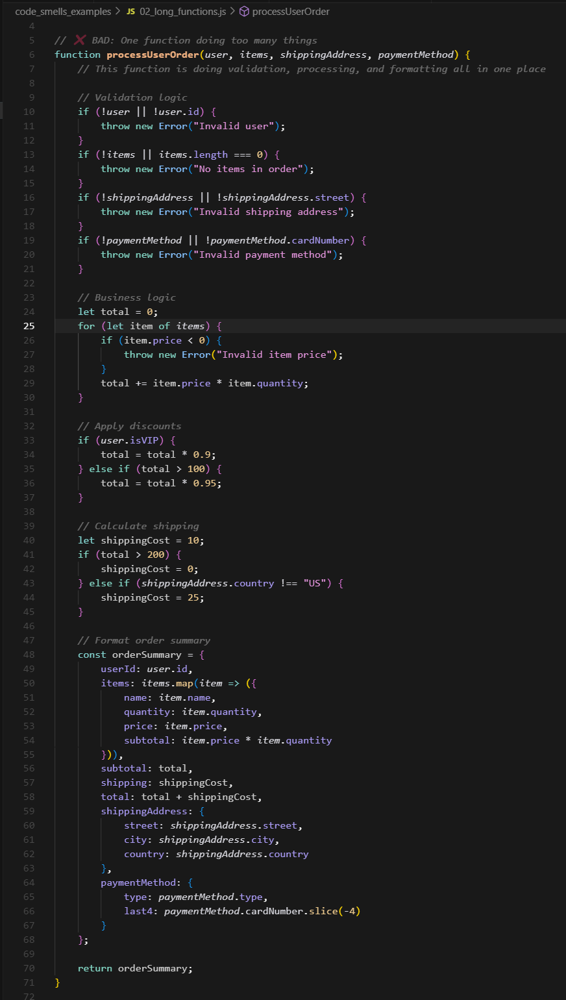
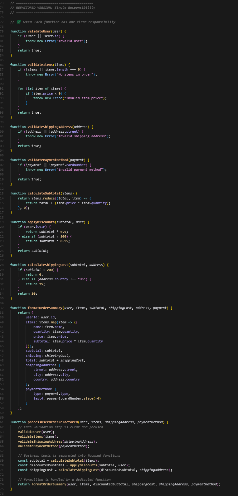
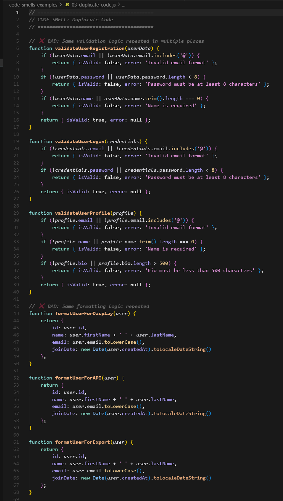
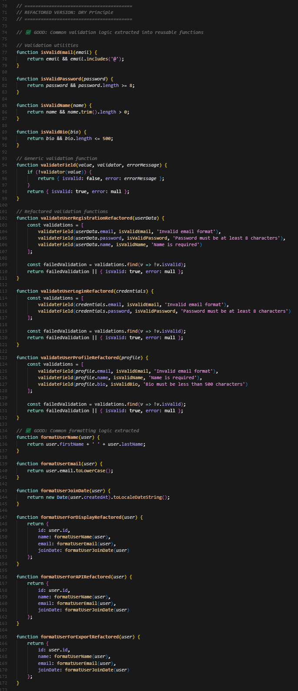
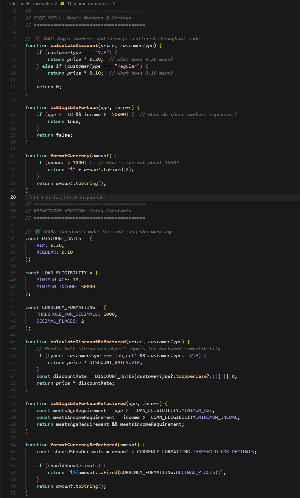

# Code Smells and Their Impact on Code Quality

## What are Code Smells?

Code smells are indicators of potential problems in code that may lead to poor maintainability, readability, and debugging difficulties. They are warning signs that suggest the code might need refactoring.

## Common Code Smells and Their Impact

### 1. Magic Numbers & Strings
**Problem**: Hardcoded values scattered throughout code make it difficult to understand and maintain.
**Impact**: 
- Changes require finding and updating multiple locations
- Code becomes less readable and self-documenting
- Higher risk of introducing bugs during maintenance

**Example**: `if (age >= 18)` vs `if (age >= LEGAL_DRIVING_AGE`

### 2. Long Functions
**Problem**: Functions that do too many things violate the Single Responsibility Principle.
**Impact**:
- Hard to understand what the function does
- Difficult to test individual behaviors
- Complex debugging and maintenance

**Example**: A function that validates input, processes data, and formats output vs. separate functions for each responsibility.

### 3. Duplicate Code
**Problem**: Copy-pasted logic creates maintenance nightmares.
**Impact**:
- Bug fixes must be applied in multiple places
- Inconsistent behavior across the application
- Increased codebase size and complexity

**Example**: Multiple functions with similar validation logic vs. a single reusable validation function.

### 4. Large Classes (God Objects)
**Problem**: Classes that handle too many responsibilities violate the Single Responsibility Principle.
**Impact**:
- Hard to understand and test
- Difficult to modify without affecting other functionality
- Tight coupling between unrelated features

**Example**: A User class that handles authentication, profile management, and payment processing vs. separate classes for each concern.

### 5. Deeply Nested Conditionals
**Problem**: Complex if/else trees make code flow difficult to follow.
**Impact**:
- Hard to understand all possible execution paths
- Difficult to test edge cases
- High cyclomatic complexity

**Example**: Nested if statements vs. early returns or guard clauses.

### 6. Commented-Out Code
**Problem**: Dead code clutters the codebase and confuses developers.
**Impact**:
- Misleads developers about what code is active
- Increases cognitive load when reading code
- Version control should handle code history, not comments

**Example**: `// old code: calculateTax(income)` vs. removing unused code entirely.

### 7. Inconsistent Naming
**Problem**: Variable names that don't clearly describe their purpose.
**Impact**:
- Code becomes harder to read and understand
- Increases time needed for debugging
- Makes onboarding new developers more difficult

**Example**: `let x = 5` vs. `let userAge = 5`

## Examples and Refactored Versions

All examples are located in the `code_smells_examples/` folder:

- [Magic Numbers & Strings](code_smells_examples/01_magic_numbers.js)
- [Long Functions](code_smells_examples/02_long_functions.js)
- [Duplicate Code](code_smells_examples/03_duplicate_code.js)
- [Large Classes](code_smells_examples/04_large_classes.js)
- [Deeply Nested Conditionals](code_smells_examples/05_nested_conditionals.js)
- [Commented-Out Code](code_smells_examples/06_commented_code.js)
- [Inconsistent Naming](code_smells_examples/07_inconsistent_naming.js)

## How Refactoring Improves Code

### Readability
- Clear, descriptive names make code self-documenting
- Smaller functions are easier to understand at a glance
- Consistent patterns reduce cognitive load

### Maintainability
- Single responsibility makes changes safer and more focused
- Eliminating duplication reduces the number of places to update
- Clear structure makes it easier to locate and modify code

### Debugging Benefits
- Smaller functions are easier to test and debug
- Clear naming reduces confusion about variable purposes
- Eliminating magic numbers makes logic more transparent
- Removing dead code prevents confusion about what's actually running

## Best Practices for Avoiding Code Smells

1. **Use Constants**: Replace magic numbers/strings with named constants
2. **Single Responsibility**: Keep functions and classes focused on one thing
3. **DRY Principle**: Don't Repeat Yourself - extract common logic
4. **Early Returns**: Use guard clauses to reduce nesting
5. **Clear Naming**: Variables and functions should be self-explanatory
6. **Regular Cleanup**: Remove dead code and refactor regularly
7. **Code Reviews**: Have others review your code to catch smells early

## Personal Experience: A Real Code Smell Encounter

### The Problem I Found
While working on a user authentication system, I encountered a classic case of **Magic Numbers** that was causing confusion and maintenance headaches. The code had hardcoded values scattered throughout different functions:

```javascript
// The problematic code I found
function validateUser(user) {
    if (user.age < 18) return false;  // What's special about 18?
    if (user.password.length < 8) return false;  // Why 8 characters?
    if (user.email.indexOf('@') === -1) return false;  // Basic email check
    return true;
}

function calculateUserScore(user) {
    let score = 0;
    if (user.age >= 18) score += 10;  // Same magic number again!
    if (user.experience > 2) score += 15;  // What does 2 represent?
    return score;
}
```

### What Was Wrong
1. **Magic numbers everywhere**: `18`, `8`, `2`, `10`, `15` - no context about what these values meant
2. **Inconsistent validation**: The same age check (`>= 18`) was repeated in multiple places
3. **Hard to maintain**: When business rules changed (like minimum age becoming 21), I had to hunt through multiple files
4. **Poor readability**: New team members couldn't understand the business logic

### How I Fixed It
I refactored the code by extracting all magic numbers into a centralized configuration object:

```javascript
// The improved version
const USER_VALIDATION_RULES = {
    MINIMUM_AGE: 18,
    MINIMUM_PASSWORD_LENGTH: 8,
    MINIMUM_EXPERIENCE_YEARS: 2,
    AGE_SCORE_BONUS: 10,
    EXPERIENCE_SCORE_BONUS: 15
};

function validateUser(user) {
    const meetsAgeRequirement = user.age >= USER_VALIDATION_RULES.MINIMUM_AGE;
    const meetsPasswordRequirement = user.password.length >= USER_VALIDATION_RULES.MINIMUM_PASSWORD_LENGTH;
    const hasValidEmail = user.email.includes('@');
    
    return meetsAgeRequirement && meetsPasswordRequirement && hasValidEmail;
}

function calculateUserScore(user) {
    let score = 0;
    if (user.age >= USER_VALIDATION_RULES.MINIMUM_AGE) {
        score += USER_VALIDATION_RULES.AGE_SCORE_BONUS;
    }
    if (user.experience > USER_VALIDATION_RULES.MINIMUM_EXPERIENCE_YEARS) {
        score += USER_VALIDATION_RULES.EXPERIENCE_SCORE_BONUS;
    }
    return score;
}
```

### The Impact
- **Maintainability**: When the minimum age changed to 21, I only needed to update one constant
- **Readability**: The code became self-documenting - anyone could understand what `MINIMUM_AGE` meant
- **Consistency**: All age-related logic now used the same constant
- **Testing**: Much easier to test edge cases by modifying the constants

### Screenshots of My Refactoring Process

Here are the before and after screenshots showing my actual refactoring work:

#### Magic Numbers Refactoring

*Before: Magic numbers scattered throughout the code*


*After: Clean constants that make the code self-documenting*

#### Duplicate Code Refactoring

*Before: Duplicate validation logic in multiple functions*


*After: Extracted common logic into reusable functions*

#### Proof of Refactoring Work

*Evidence of hands-on refactoring work in my code editor*

This experience taught me that code smells aren't just theoretical concepts - they're real problems that impact daily development work. The refactoring process, while initially time-consuming, saved hours of debugging and maintenance later.
